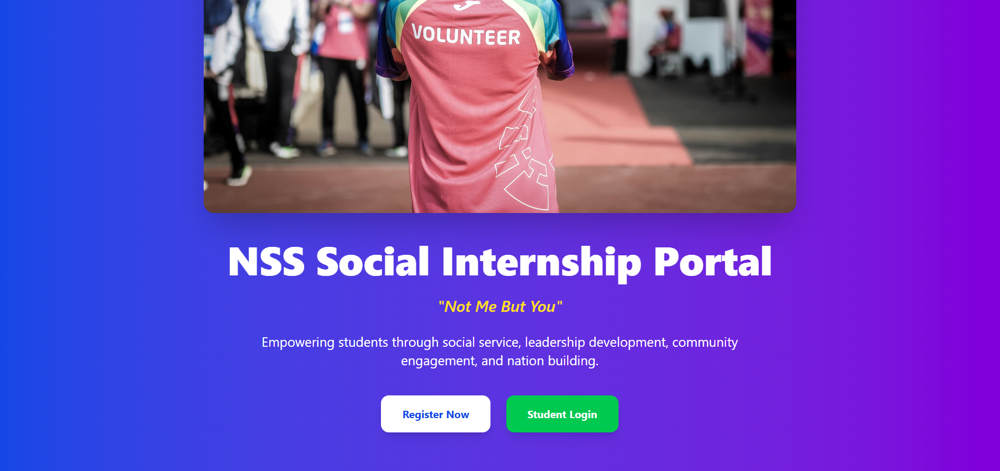
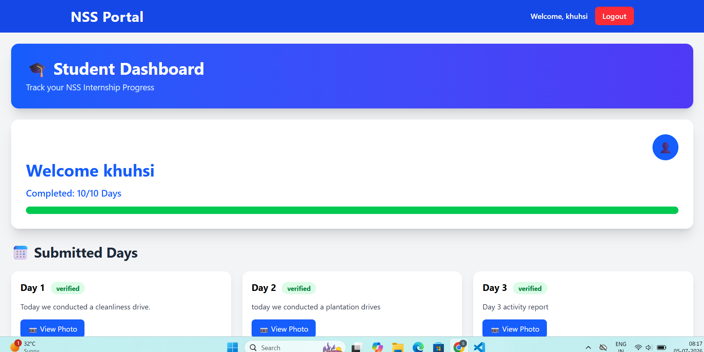
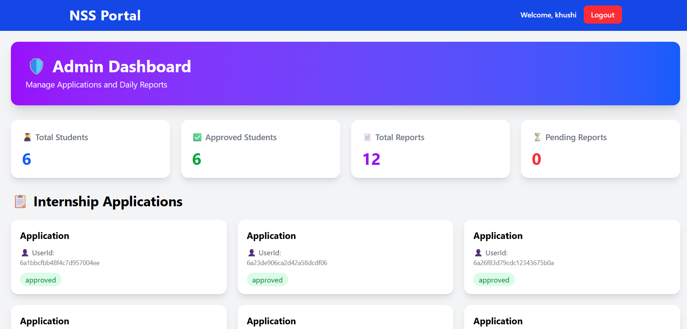
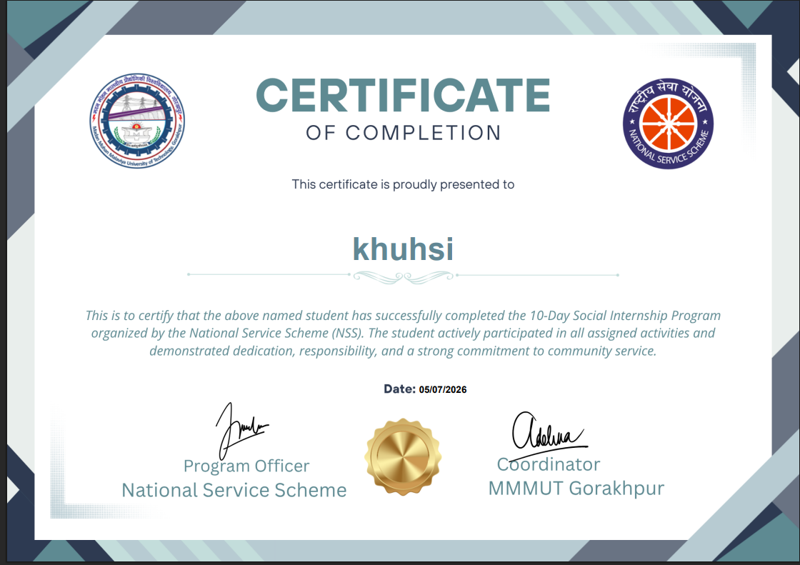

# NSS Social Internship Portal

A full-stack MERN application developed to manage the NSS social internship process. The portal enables students to apply for internships, submit daily reports, receive certificates, and allows administrators to verify submissions and manage internship activities.

---

## Features

- Student Registration & Login
- Admin Dashboard
- Student Profile Management
- Internship Application
- Daily Report Submission
- Image Upload with Cloudinary
- Email Notifications
- Certificate Generation
- Responsive Design

---

## Tech Stack

Frontend:
- React.js
- Tailwind CSS
- Axios

Backend:
- Node.js
- Express.js

Database:
- MongoDB

Other:
- Cloudinary
- Nodemailer
- PDF-lib

---

## Installation

npm install

npm run dev

---

## Screenshots

(Home Page) 

(Student Dashboard) 

(Admin Dashboard) 

(Certificate)

---

## Author

Srishti Shukla

Disclaimer: This project was developed for educational purposes as a college MERN stack project. 
The NSS and MMMUT logos are used only for demonstration and academic purposes. This is not an official university or NSS portal.
